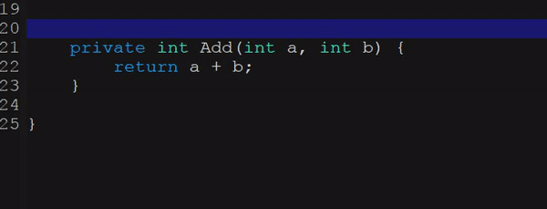

[](https://www.gnu.org/licenses/gpl-3.0)
[](https://jcs-emacs.github.io/jcs-elpa/#/ts-docstr)

# ts-docstr
> A document string minor mode using tree-sitter

[](https://github.com/emacs-vs/ts-docstr/actions/workflows/test.yml)
[](https://github.com/emacs-vs/ts-docstr/actions/workflows/docs.yml)

<!-- markdown-toc start - Don't edit this section. Run M-x markdown-toc-refresh-toc -->
**Table of Contents**

- [ts-docstr](#ts-docstr)
  - [💾 Installation](#💾-installation)
    - [🔍 Method 1. with `straight.el` and `use-package`:](#🔍-method-1-with-straightel-and-use-package)
    - [🔍 Method 2. Manual](#🔍-method-2-manual)
  - [📇 Commands](#📇-commands)
  - [🔧 Customization](#🔧-customization)
    - [🎨 Styles](#🎨-styles)
    - [⌨️ Keys](#️-keys)
    - [💬 Ask to select the style](#💬-ask-to-select-the-style)
    - [🎣 Hooks](#🎣-hooks)
  - [🔨 Supported languages](#🔨-supported-languages)
- [🛠️ Contribute](#🛠️-contribute)
  - [-](#-)
  - [⚜️ License](#⚜️-license)
    - [❓ How to support my favorite language?](#❓-how-to-support-my-favorite-language)
      - [🔍 The `activate` function](#🔍-the-activate-function)
      - [🔍 The `parse` function](#🔍-the-parse-function)
      - [🔍 The `insert` function](#🔍-the-insert-function)
    - [❓ How to add a document string style?](#❓-how-to-add-a-document-string-style)
    - [❓ How to trigger by a key?](#❓-how-to-trigger-by-a-key)

<!-- markdown-toc end -->

## 💾 Installation

### 🔍 Method 1. with `straight.el` and `use-package`:

```elisp
(use-package ts-docstr 
  :straight (ts-docstr :type git :host github :repo "emacs-vs/ts-docstr"
                       :files (:defaults "langs/*.el")))
```

### 🔍 Method 2. Manual

```sh
git clone https://github.com/emacs-vs/ts-docstr /path/to/lib
```

then in Emacs:

```elisp
(add-to-list 'load-path "/path/to/lib")
(require ts-docstr)
```

or

```elisp
(use-package ts-docstr
  :load-path "/path/to/lib")
```

## 📇 Commands

| Commands             | Description                                     |
|:---------------------|:------------------------------------------------|
| `ts-docstr-at-point` | Add document string at current point.           |
| `ts-docstr-mode`     | Use nature key bindings.                        |
| `ts-docstr-ask`      | Ask and update document string style (locally). |

## 🔧 Customization

### 🎨 Styles

The style can be customized by setting the variable with this pattern
`ts-docstr-[lang]-style`. Here is an example to set `Java` docstring style
to `Javadoc`.

```elisp
(setq ts-docstr-java-style 'javadoc)
```

### ⌨️ Keys

Better editing experience,

```elisp
(setq ts-docstr-key-support t)
```

Then do `M-x ts-docstr-mode`.

### 💬 Ask to select the style

```elisp
(setq ts-docstr-ask-on-enable t)
```

<p align="center">
  
</p>

### 🎣 Hooks

Hook patterns are:

* `ts-docstr-[module]-before-[activate/parse/insert]-hook`
* `ts-docstr-[module]-after-[activate/parse/insert]-hook`

For example,

* `ts-docstr-c++-before-activate-hook`

or just a general one, (without the language name)

* `ts-docstr-before-activate-hook`

## 🔨 Supported languages
> ⚠️ Please sort these two lists alphabetically!

These languages are fairly complete:

* C / C++ / C#
* Go
* Java / JavaScript
* Lua
* PHP / Python
* Ruby / Rust
* Scala
* Swift
* TypeScript

These languages are in development:

* Elixir
* Haskell
* Shellscript

# 🛠️ Contribute

[](http://makeapullrequest.com)
[](https://github.com/bbatsov/emacs-lisp-style-guide)
[](https://www.paypal.me/jcs090218)
[](https://www.patreon.com/jcs090218)

If you would like to contribute to this project, you may either clone and make
pull requests to this repository. Or you can clone the project and establish
your own branch of this tool. Any methods are welcome!

### 🔬 Development

To run the test locally, you will need the following tools:

- [Eask](https://emacs-eask.github.io/)
- [Make](https://www.gnu.org/software/make/) (optional)

Install all dependencies and development dependencies:

```sh
$ eask install-deps --dev
```

To test the package's installation:

```sh
$ eask package
$ eask install
```

To test compilation:

```sh
$ eask compile
```

**🪧 The following steps are optional, but we recommend you follow these lint results!**

The built-in `checkdoc` linter:

```sh
$ eask lint checkdoc
```

The standard `package` linter:

```sh
$ eask lint package
```

*📝 P.S. For more information, find the Eask manual at https://emacs-eask.github.io/.*

## ⚜️ License

This program is free software; you can redistribute it and/or modify
it under the terms of the GNU General Public License as published by
the Free Software Foundation, either version 3 of the License, or
(at your option) any later version.

This program is distributed in the hope that it will be useful,
but WITHOUT ANY WARRANTY; without even the implied warranty of
MERCHANTABILITY or FITNESS FOR A PARTICULAR PURPOSE.  See the
GNU General Public License for more details.

You should have received a copy of the GNU General Public License
along with this program.  If not, see <https://www.gnu.org/licenses/>.

See [`LICENSE`](./LICENSE.txt) for details.

### ❓ How to support my favorite language?

> ⚠ Before you start, make sure [tree-sitter-langs](https://github.com/emacs-tree-sitter/tree-sitter-langs)
> supports the language you want to add!

> ⚠ The best way to learn how the entire process works is to look into other
> files in the `/langs` folder from the project root. Find a similar language
> and see through code, all languages' implementation are very similar to one
> another.

All parsers are defined in the `/langs` folder from the project root. The file
is named with the prefix `ts-docstr-` followed by the `language name`. For
example, if you want to create a parser for the `C` programming languge; the
file should be named `ts-docstr-c.el`.

The parser file is consist in three part:

* ts-docstr-[lang]-activate `()`
* ts-docstr-[lang]-parse `(node)`
* ts-docstr-[lang]-insert `(node data)`

#### 🔍 The `activate` function

The `activate` function is used to search for a node and confirm weather it
should insert a document string. This function will eventually return a captured
node, or return `nil` if we shouldn't insert a document string here.

Here is the simplified version of `Java` activate function:

```elisp
;;;###autoload
(defun ts-docstr-java-activate ()
  "..."
  ;; Narrow region to next line, this defines the valid region to insert a
  ;; document string.
  (ts-docstr-c-like-narrow-region
    ;; We grab a list of node from the narrowed region, here we try to capture
    ;; a `class' or `method' declaration. If this returns 2 or more nodes,
    ;; report an error since we don't expect these declarations happened on the
    ;; same line (region).
    (nth 0 (ts-docstr-grab-nodes-in-range '(class_declaration
                                            method_declaration)))))
```

Use `ts-docstr-activatable-p` function to check to see if you are able to insert
a document string at point, this function returns a node.

```elisp
(defun print-activate-node ()
  (interactive)  ; make interactive, so you could M-x
  (message "node: %s" (ts-docstr-activatable-p)))
```

Evaluate, then `M-x print-activate-node` to see if it return something or `nil`.

#### 🔍 The `parse` function

The `parse` function takes one argument `node` from the `activate` function.
In this stage, we collect all necessary data (`paramters`, `class`/`enum` name,
etc) and put into a property list.

Here is a simplest `parse` function for example:

```elisp
;;;###autoload
(defun ts-docstr-java-parse (node)
  "..."
  (if (equal (tsc-node-type node) 'method_declaration)
      ;; `types' and `variables' are lists. Each store typenames and variables
      ;; name. We simply parse the tree/node in this steps.
      (list :type types :variable variables
            :return (ts-docstr-java--parse-return params)  ; return `t' or `nil'
            :name (ts-docstr-java--get-name node))         ; return `function' name
    ;; For `class', we don't need to parse parameters.
    (list :name (ts-docstr-java--get-name node))))         ; return `class' name
```

#### 🔍 The `insert` function

The `insert` function takes two arguments `node` and `data` from previous
stages. We will need to define a config variable and function.

The config variable:

```elisp

(defcustom ts-docstr-java-style 'javadoc
  "..."
  :type '(choice (const :tag "No specify" nil)
                 (const :tag "Javadoc Style" javadoc)))
```

The config function:

```elisp
;; This is later called and exposed in the insertion function.
(defun ts-docstr-java-config ()
  "..."
  (cl-case ts-docstr-java-style  ; define the style by each style guide
    (javadoc (list :start "/**"  ; this plist is later used in insertion function
                   :prefix "* "
                   :end "*/"
                   :summary "{d}"
                   :param "@param {v} {d}"
                   :return "@return {d}"))
    (t ...)))
```

Lastly, you can create the `insert` function. In this stage you will write data
to the current file.

```elisp
(defun ts-docstr-java-insert (node data)
  "Insert document string upon NODE and DATA."
  (ts-docstr-inserting
    (ts-docstr-insert c-start "\n")                              ; /**
    (ts-docstr-insert c-prefix " " (plist-get data :name) "\n")  ;  * NAME
    (ts-docstr-insert c-end)))                                   ;  */
```

```java
/**
 * Example
 */
class Example {}
```

### ❓ How to add a document string style?

Find the language file in the `/langs` folder from the project root, if you
couldn't find it, see [❓ How to support my favorite language?](https://github.com/emacs-vs/ts-docstr#-how-to-support-my-favorite-language).

First look into the variable with the name similar to `ts-docstr-[lang]-style`.
See the following example,

```elisp
;; langs/ts-docstr-java.el
(defcustom ts-docstr-java-style 'javadoc
  "..."
  :type '(choice (const :tag "No specify" nil)
                 (const :tag "Javadoc Style" javadoc)))
```

See if the style is already supported. Continue reading if it does **NOT**, 
there are two parts you need to change in order to support your favorite style!

First, you need to add an option to the style variable so other people would
notice the changes.

```elisp
...
  :type '(choice (const :tag "No specify" nil)
                 (const :tag "New Doc Style" new-doc-style)
...
```

Then next (last) step is to do the implementation in the insertion function.
The implementation is isolated and complex depends on the style you targeted.
Here we show the core logic of the implementation, but we prefer to look right
into the code:

```elisp
...
(ts-docstr-with-style-case
  (new-doc-style  ; listen to new-doc-style
   (insert "My new docstring style! :)"))
...
```

### ❓ How to trigger by a key?

To insert document string with key is to use `ts-docstr-mode`. The entire key
related logic is placed in `ts-docstr-key.el` file from the project root. 
To implement one, you first need to design the method to insert the entire
document string (I called it triggeration function, or trigger). For example,
in `C#`, you can trigger the document string insertion function by hittting
the third slash in a line.

<p align="center">
  
</p>

Once you have an idea, write the function to do the action. Here is the example
for C# slash triggeration function.

> ⚠ Check before you do, may be the triggeration is already there, and make
> sure your design doesn't conflict with other keys!

```elisp
(defun ts-docstr-key-csharp-/ (&rest _)
  "..."
  (ts-docstr-key--with-env '(csharp-mode)         ; Make sure it doesn't pollute other file
    (when (and (ts-docstr--line-is "///")         ; Make sure the line consist of ///
               (ts-docstr--looking-back "///" 3)  ; Make sure cursor is at the end of ///
               (ts-docstr-activatable-p))         ; Check valid docstring insertion point
      (backward-delete-char 3)                    ; Delete all slashes, ready to do docstrnig insertion
      (ts-docstr-at-point))))                     ; Do docstring insertion
```

Then you would just need to register the function to variable `ts-docstr-key-alist.

```elisp
(defcustom ts-docstr-key-alist
  `(("RET" . ts-docstr-key-doxygen-like-return)
    ("/"   . ts-docstr-key-csharp-/)             ; Add this line!
    ("/"   . ts-docstr-key-go-/)
...
```
